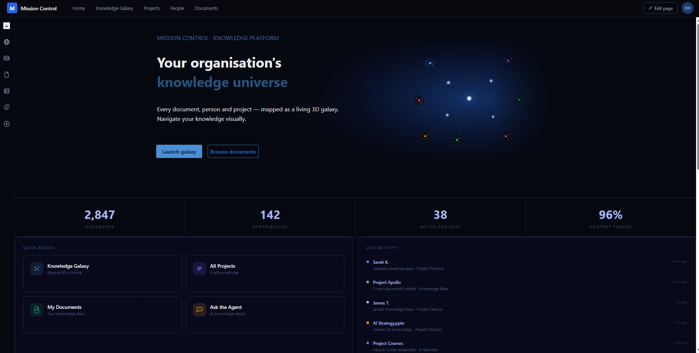
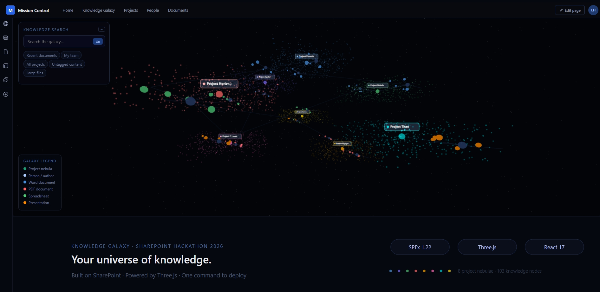

# 🌌 Knowledge Galaxy

> Your organisation's knowledge universe — built for SharePoint Hackathon 2026




## What is this?

Knowledge Galaxy transforms SharePoint document libraries into an 
interactive 3D galaxy where documents are stars, people are planets 
and projects are nebulae.

## YouTube Video

[https://www.youtube.com/watch?v=9bpD2uIGnFQ](https://www.youtube.com/watch?v=49BJtthTURE)

## Quick start
```bash
# Install dependencies
npm install

# Run locally
gulp trust-dev-cert
gulp serve
```

## Deploy to SharePoint
```powershell
cd deployment
.\deploy.ps1 -SiteUrl "https://yourtenant.sharepoint.com/sites/mission-control"
```

## Features
- 3D galaxy rendering with Three.js
- 8 project nebulae with unique colours
- 103 nodes (documents, people, projects)
- Knowledge search with cascade highlighting
- Node detail panel with document/person/project info
- Camera fly-to on node click
- Cluster focus mode — everything else fades away
- Project labels floating above nebulae
- One-command PnP deployment

## Tech stack
SPFx 1.22 · React · TypeScript · Three.js · PnP PowerShell

## Documentation
- [Submission](docs/SUBMISSION.md)
- [Architecture](docs/ARCHITECTURE.md)
- [Deployment Guide](deployment/README.md)
- [Demo Script](docs/demo-script.md)

## SharePoint Hackathon 2026
Submitted for categories:
- Most innovative SharePoint experience with SPFx
- Best design for SharePoint Site
- Best use of custom agents with SharePoint
